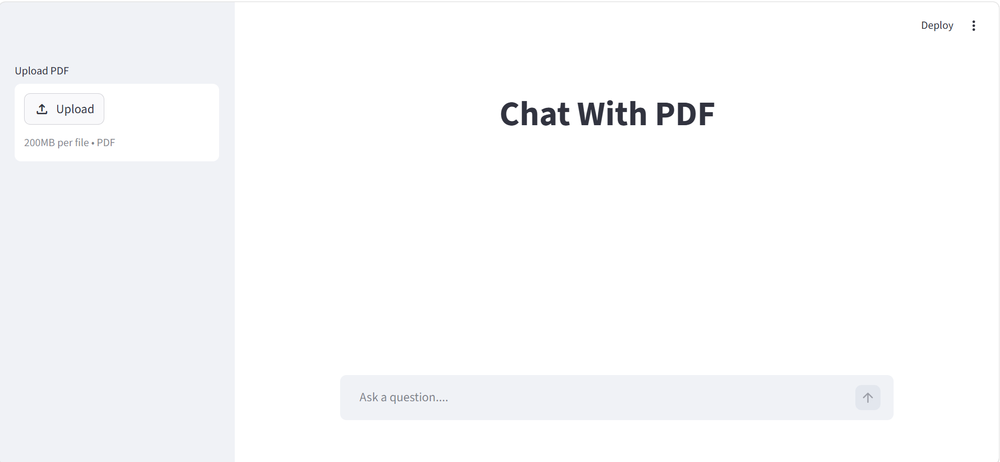

# Chat with PDF

A RAG-based chatbot that lets you chat with any PDF document.

## Tech Stack
- Langchain
- ChromaDB
- HuggingFace Embeddings
- Groq (LLaMa 3.3)
- Streamlit

## How to run
1. Install dependencies: `pip install -r requirements.txt`
2. Add your Groq API key in `.env`
3. Run: `streamlit run app.py`

